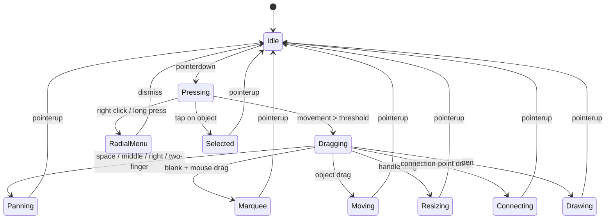

# F1 入力インテント解決

## 概要

- `InputIntentResolver`: DOM 非依存の純粋ロジック
- `CanvasInputController`: `@use-gesture/vanilla` を使う配線層

## 状態遷移

## ルール要約

1. Wheel は zoom / shift+wheel は horizontal pan / ctrl+wheel は precise zoom
2. Middle / right / space+left / two-finger drag は pan
3. 500ms 以上の long press と contextmenu は radial menu
4. Object / handle / connection-point / blank / text の hit target に応じて intent を返す
5. Pen は draw、palm は ignore

