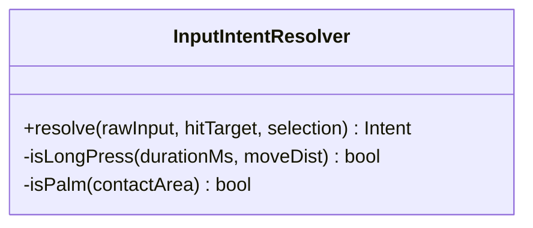
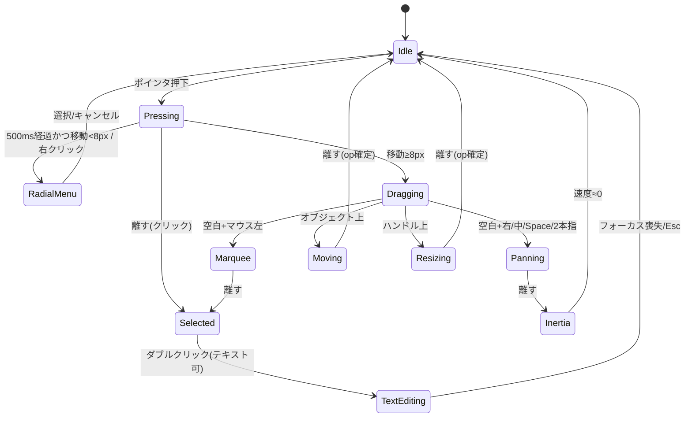
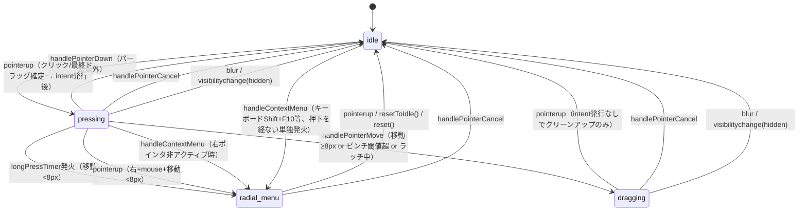
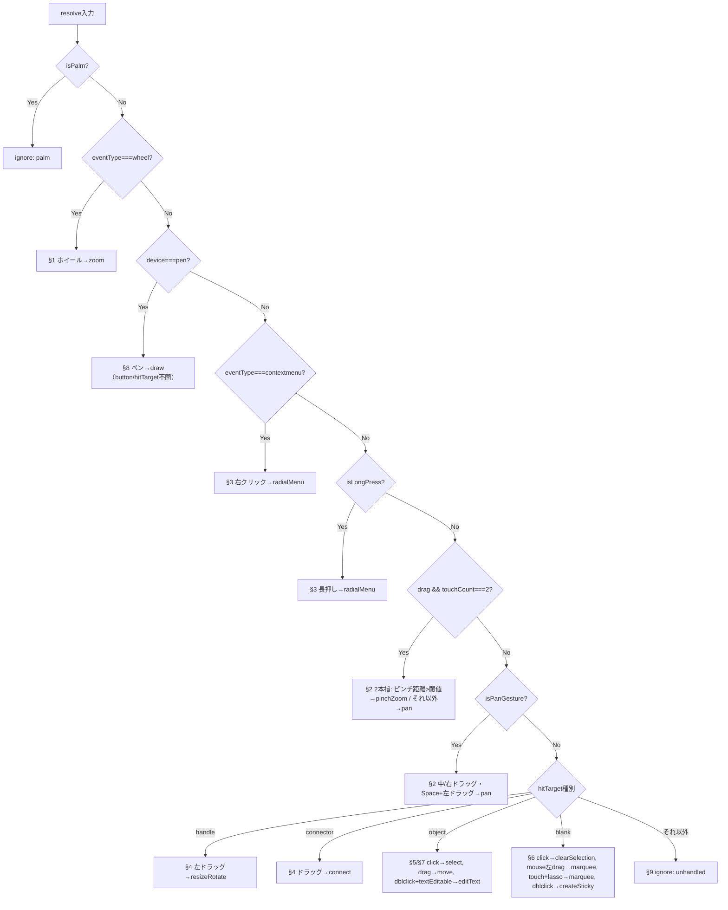
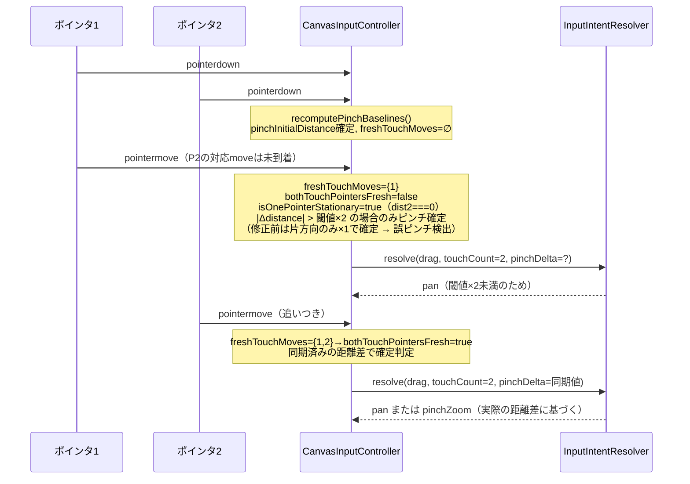
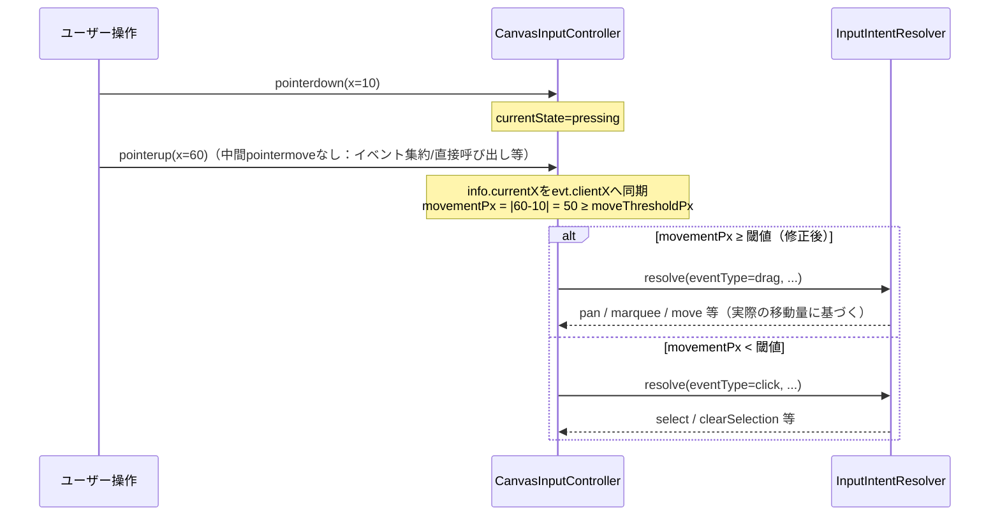

# F1 入力インテント解決関数 — 仕様抽出＋実装検証

出典: `questboard_design_document.md`（読み取り専用・Claude Opus管轄）から F1 関連箇所のみを抽出し、
実装 (`src/lib/input-intent-resolver.ts`) との整合を検証する。設計書本体は改変しない。

## 1. 原仕様（引用）

### 1.1 自然言語ロジック（design doc §1.5）

> 入力（デバイス種別、ボタン/タッチ数、修飾キー、ヒット対象、移動量、押下時間、現在選択、パーム接触面積）を受け取り、以下の優先順で意図を一意に返す。
> 1. ホイール＝ズーム（Ctrl+ホイール＝精密ズーム、Shift+ホイール＝横パン）
> 2. 中ボタンドラッグ／右ボタンドラッグ／Space+左ドラッグ／2本指ドラッグ＝パン（2本指の指間距離変化が閾値超ならピンチズーム）
> 3. 右クリック、または「押下500ms以上かつ移動8px未満」の長押し＝ラジアルメニュー起動
> 4. ハンドル上の左ドラッグ＝リサイズ/回転、接続点ドラッグ＝接続線作成
> 5. オブジェクト上：左クリック＝選択（Shift+クリック＝追加/除外選択）、左ドラッグ＝移動（Ctrl+ドラッグ＝複製移動）
> 6. 空白：左クリック＝選択解除、**マウスの**左ドラッグ＝範囲選択（タッチは投げ縄ツールをラジアルメニューで明示選択した時のみ範囲選択）、ダブルクリック＝付箋作成
> 7. テキスト可能オブジェクトのダブルクリック＝テキスト編集開始
> 8. ペン＝描画。接触面積が閾値超の接触はパームとして拒否
> 9. いずれにも該当しない入力は無視（例外を出さない）

### 1.2 クラス図（design doc §5、抜粋）

`CanvasInputController`（DOMイベント⇔`InputIntentResolver`のブリッジ、ポインタ追跡・ピンチ/ラッチ状態管理を担う）は
設計書のどの図にも登場しない。実装のみに存在する層であり、以下 §3 で別途扱う。

### 1.3 状態遷移図（design doc §6.1、原文のまま）

---

## 2. 実装の状態遷移図（`CanvasInputController.currentState`）

### 差分メモ

| 原仕様の状態 | 実装での扱い |
|---|---|
| `Panning` / `Marquee` / `Moving` / `Resizing` | `currentState` としては存在しない。すべて `dragging` 中に**毎フレーム emit される intent の種別**（`pan`/`marquee`/`move`/`resizeRotate`）として表現される。 |
| `Inertia` | F1実装には存在しない（F3 カメラ制御関数側の責務）。 |
| `Selected` | 状態ではなく `select`/`clearSelection` intent。コントローラは選択後 `idle` に戻る。 |
| `TextEditing` | `editText` intent 発行のみ。編集モード自体の状態管理はF1の外（UI側）。 |

**結論**: 実装は原仕様の状態遷移図より状態数が少ない4状態機械（`idle/pressing/dragging/radial_menu`）で、
仕様図のリッチな状態はすべて「`dragging`中に流れるintentのストリーム」として設計されている。挙動としては等価だが、
設計書の図だけを見るとintentとstateを混同しやすく、レビュー時の誤解の原因になり得る。**要: 設計書側に注記を追加検討**（Opus管轄のため本ファイルでは提案に留める）。

---

## 3. 優先順位フローチャート（`InputIntentResolver.resolve()` の実際の分岐順）

### 検証結果（原仕様の番号順 vs 実装の評価順）

| # | 原仕様の優先順位 | 実装の評価順 | 判定 |
|---|---|---|---|
| — | （パーム拒否は§8内に記述） | **最優先**でパーム判定（ホイールより前） | **順序差分**。機能上はパーム＝タッチ/ペン起源でホイールと排他のため実害なし。仕様の記述位置と実装の評価順が異なる点のみ明記が必要。 |
| §1 | ホイール | パームの次に評価 | 一致 |
| §8（ペン部分） | 優先順位8（末尾寄り） | ホイールの直後、§3（右クリック/長押し）より**前**に評価 | **順序差分（要確認）**。詳細は下記コラム参照。 |
| §3 | 右クリック/長押し | ペン判定の後 | ネイティブ`contextmenu`DOMイベント経由では`CanvasInputController.handleContextMenu`が`resolve()`を経由せず直接`radialMenu`を発行するため、実質的にデバイス不問で優先される（結果的に仕様と一致）。一方`pointerdown`+`pointerup(button=2)`のみでcontextmenuイベントが発火しない経路（回帰テストsequence 38）では、ペン入力は`resolve()`内の§8分岐が先に効き`draw`になる。 |
| §2 | パン/ピンチ | §3の後 | 概ね一致。ただし2本指の非同期到着時の判定ヒューリスティックは原仕様に記述がない（§4参照） |
| §4〜§7 | ハンドル/オブジェクト/空白/テキスト | 変更なし | 一致 |
| §9 | 無視 | 変更なし | 一致 |

#### コラム: ペン右クリックの経路依存

- 実ブラウザの`contextmenu`イベント経由（`handleContextMenu`） → **仕様通り** `radialMenu`。
- `pointerdown(button=2)`→`pointerup(button=2)`のみで`contextmenu`イベントが発火しない環境（一部スタイラス/バレルボタン実装依存） → `resolve()`の§8分岐が先に評価され `draw`。

回帰テスト`sequence 38`はこの後者の経路を明示的に「`radialMenu`にならないこと」で固定しており、意図的な実装判断と見られるが、
原仕様の文面（優先順位3が8より上位）とは矛盾する。**設計チーム（Opus）に確認し、(a) 仕様側に経路依存の例外を明記する
か、(b) 実装側で§3相当のチェックを§8より前に統一するか、いずれかの決定が必要。**

---

## 4. 実装のみに存在する拡張ロジック（原仕様に記述なし）

`CanvasInputController`はDOMの非同期・分割配信されるポインタイベントを`InputIntentResolver`の
単発判定に変換するために、原仕様には現れないヒューリスティックを追加している。いずれも
Codexのセキュリティ/コードレビュー指摘（PR #43）を受けて修正済みで、回帰テストで担保されている。

### 4.1 非同期2本指パン/ピンチ判別

- 原仕様は「2本指の指間距離変化が閾値超ならピンチズーム」とのみ記述し、**イベントが2本指同時に届くことを暗黙の前提**にしている。
- 実ブラウザ/実タッチデバイスではポインタイベントが1本ずつ非同期に届くため、素朴な実装だと「先に届いた1本の移動だけで距離差を計算」してしまい、
  純粋なパン中に一瞬`pinchZoom`が誤発火する（PR #43 Codexレビュー指摘・修正済み）。
- 対策: 片方が未更新（`isOnePointerStationary`）の状態で確定させる閾値を、原仕様にない**閾値の2倍**まで引き上げ、
  「本当に片指固定のピンチ」（大きな1フレーム変化）と「もう一方の指がまだ追いついていないだけのパン」（閾値をわずかに超える程度の変化）を区別。
- 回帰テスト: `sequence 39`（左指先行・中心方向）, `sequence 41`（真の片指固定ピンチ）, `sequence 42`（右指先行・外側方向、修正前は誤検出していたケース）。

### 4.2 `pointerup`最終座標の同期とドラッグ確定

- 原仕様は「押下→離す」の間に発生する移動量の**取得経路**（`pointermove`の有無）に一切言及していない。
- 実装は当初、`pointerup`イベント自体が座標を運んできても`PointerInfo.currentX/Y`を更新しておらず、
  中間`pointermove`が届かないケース（イベント集約、公開ハンドラーの直接呼び出し）で大きな移動が「クリック」として誤解決されていた（PR #43 Codexレビュー指摘・修正済み）。
- 座標同期後もなお`currentState`が`pressing`のまま`eventType: 'click'`で解決される残存バグがあり、
  「同期後の移動量が閾値以上なら`eventType: 'drag'`として解決する」よう追加修正（Codex再指摘・修正済み）。
- 回帰テスト: `sequence 43`（右ボタン・閾値超ジャンプ→`pan`）, `sequence 44`（左ボタン・閾値超ジャンプ→`marquee`）。

---

## 5. 検証結果まとめ

| 項目 | 判定 | 備考 |
|---|---|---|
| §1 ホイール | 一致 | |
| §2 パン/ピンチ（同期データ） | 一致 | |
| §2 パン/ピンチ（非同期到着） | 仕様未定義 → 実装で補完・テスト担保 | §4.1 |
| §3 右クリック/長押し | 経路依存の差分あり | contextmenuイベント経由は一致、pointerdown/up直叩き経路はペン判定が優先 |
| §4〜§7 ハンドル/オブジェクト/空白/テキスト | 一致 | |
| §8 パーム拒否 | 評価順が仕様より前（実質最優先） | 機能上の実害なし |
| §8 ペン＝描画 | 評価順が仕様より前（§3より先） | 経路依存、要チーム確認 |
| §9 無視 | 一致 | |
| `pointerup`座標同期・ドラッグ確定 | 仕様未定義 → 実装で補完・テスト担保 | §4.2 |
| 状態遷移（4状態 vs 設計書の9状態) | 等価だが粒度が異なる | §2 |

### 残課題（要意思決定・Opus/設計側）

1. ペン右クリックの扱い（§3 vs §8 の優先順位）を、`pointerdown`/`pointerup`直叩き経路でも仕様通り§3優先にするか、
   現状の実装（経路依存）を正として設計書に注記するかを決定する。
2. 非同期2本指判別・`pointerup`座標同期の2ロジックは、原仕様には存在しない実装詳細であるため、
   design doc §1.5 の「主な改善履歴」（107行目）に追記するか、本SPECファイルを正式な補足資料として参照させるかを決定する。
