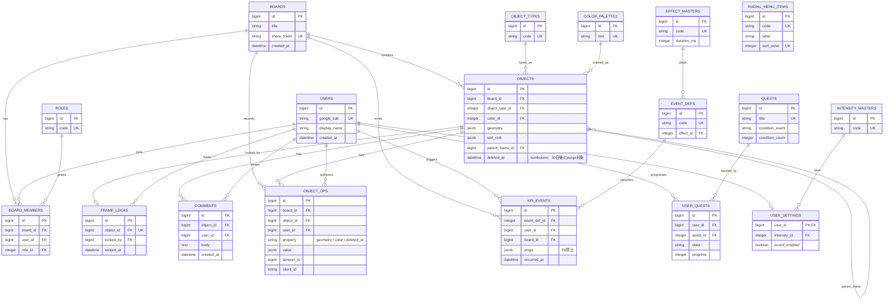

# ER図（実装済みスキーマ）

`src/backend/db/schema.rb`（version 2026_07_20_230735）からのリバースエンジニアリング。

`RADIAL_MENU_ITEMS` は他テーブルとの外部キー関係を持たない独立したマスタテーブル（UI用ラジアルメニュー項目）。

`object_ops` の `(object_id, client_id, lamport_ts)` 一意インデックスが、同一opの再送を冪等にする仕組みの核。詳細は [`SPEC/api/rails-backend.md`](../api/rails-backend.md) の「オブジェクト」節を参照。
