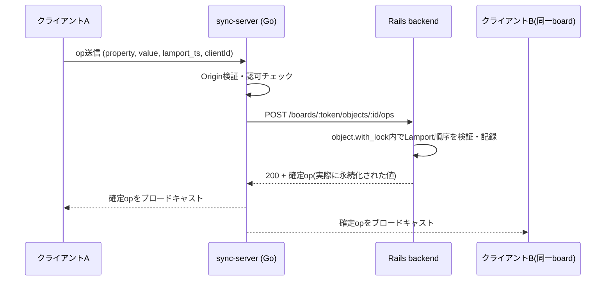
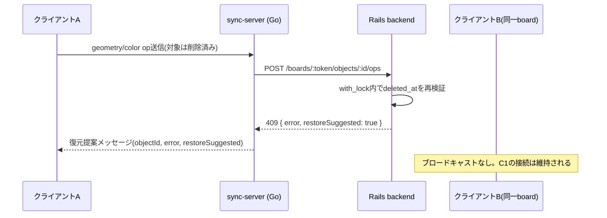
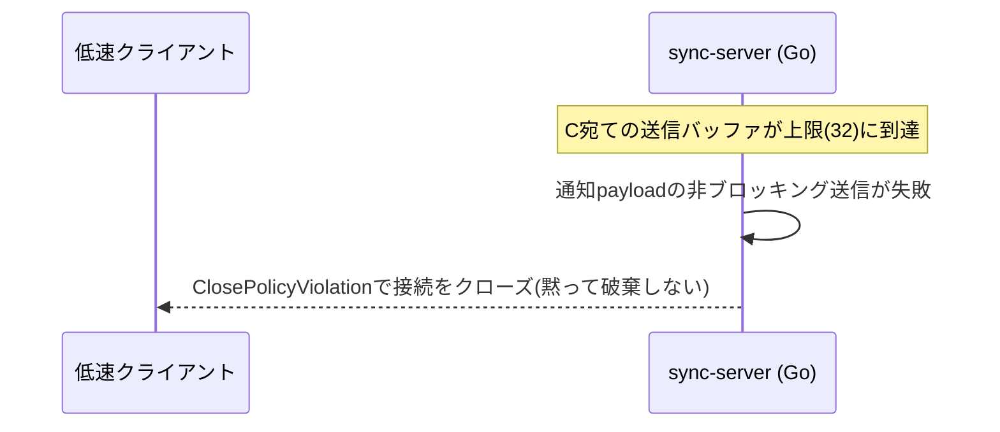
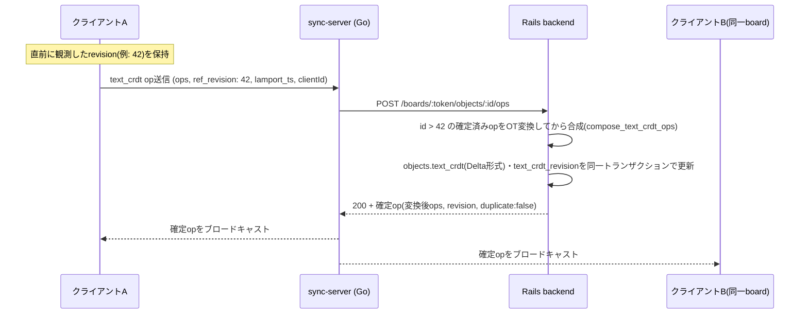
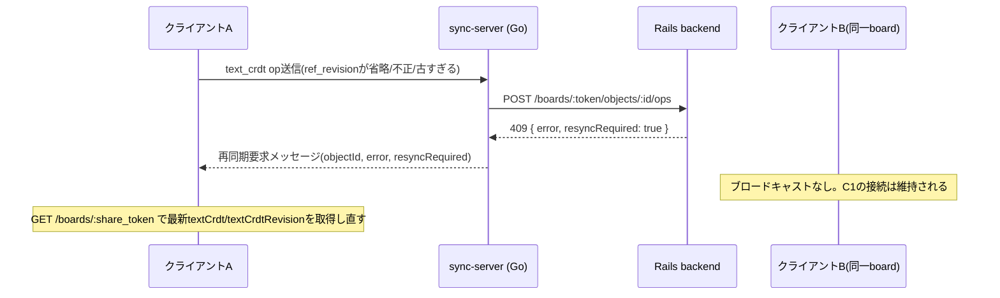
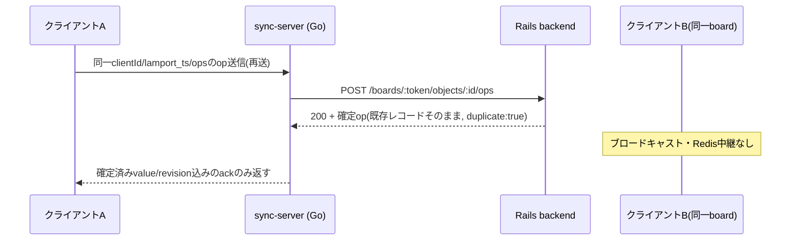
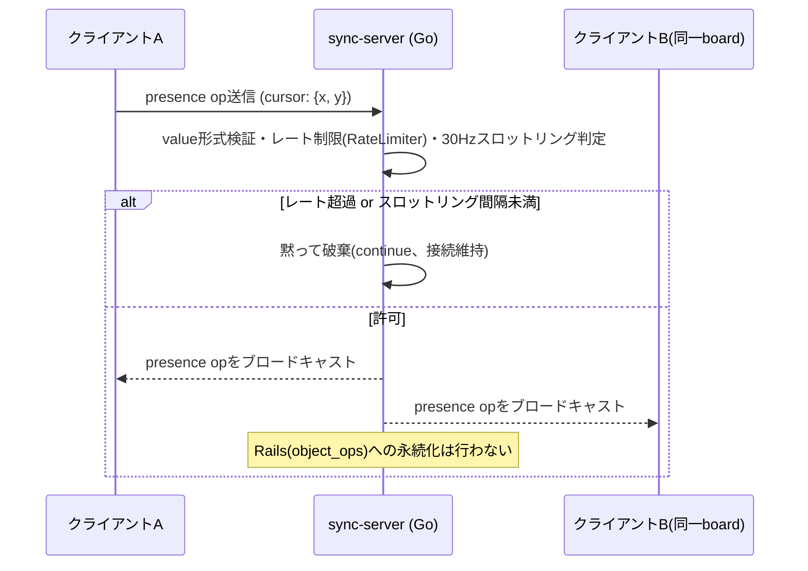

# シーケンス図（op同期フロー）

`/ws` 経由でクライアントがopを送信してから、他クライアントへブロードキャストされるまでの実装済みフロー。実装は `src/sync-server/internal/ws/handler.go`、`src/backend/app/controllers/objects_controller.rb`。

## 通常の確定op

## 削除済みオブジェクトへの編集（tombstone競合）

## 送信キュー溢れ時の切断

## `text_crdt`のOT変換を伴う確定op

クライアントAが観測後のrevisionを基準（`ref_revision`）に差分を送るが、それより後にクライアントBの編集が確定済みの場合。実装は `ObjectsController#transform_text_crdt_ops`, `TextOT.transform`。

## `ref_revision`不正・履歴超過による再同期要求

## 重複op(ack再送)

ACK消失などで同じ`clientId`/`lamport_ts`のopが再送された場合。他クライアントは初回確定時に既に反映済みのため、再ブロードキャストしない。

## `presence`（カーソル位置）のブロードキャスト

Railsへは永続化せず、sync-server内で完結する。実装は `internal/ws/handler.go`, `internal/ws/limiter.go`。

