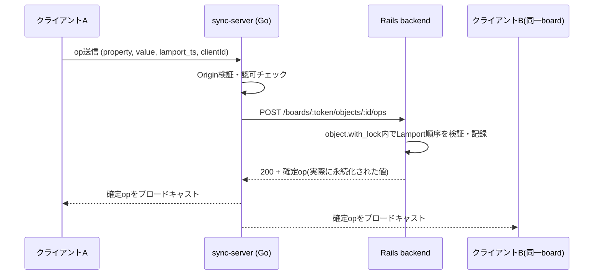
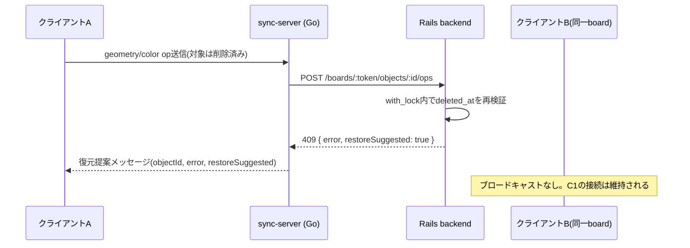
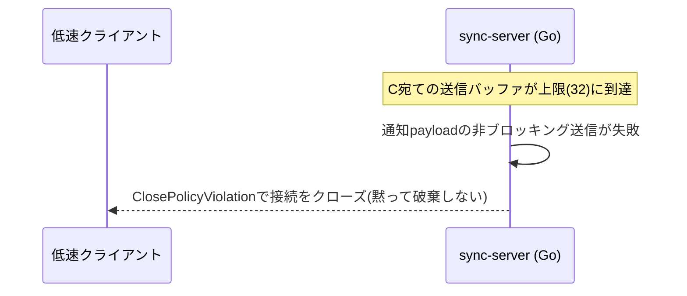

# シーケンス図（op同期フロー）

`/ws` 経由でクライアントがopを送信してから、他クライアントへブロードキャストされるまでの実装済みフロー。実装は `src/sync-server/internal/ws/handler.go`、`src/backend/app/controllers/objects_controller.rb`。

## 通常の確定op

## 削除済みオブジェクトへの編集（tombstone競合）

## 送信キュー溢れ時の切断

