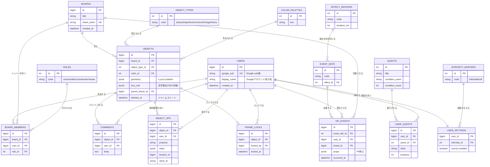
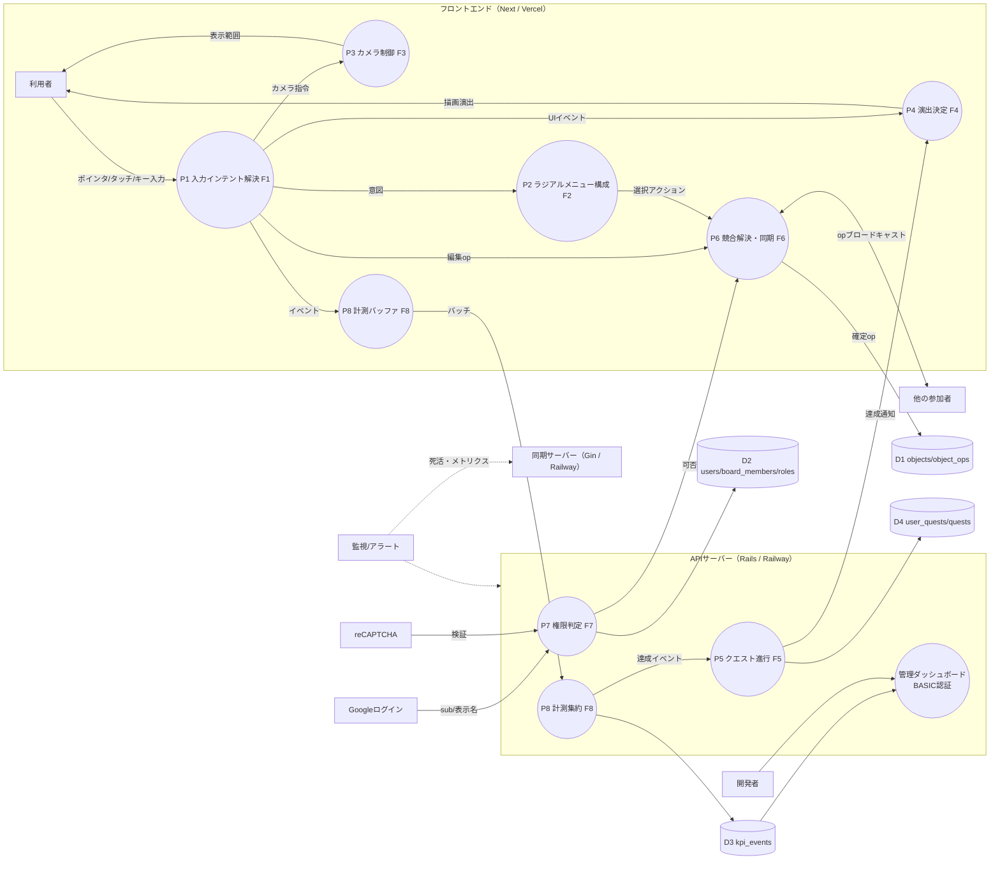
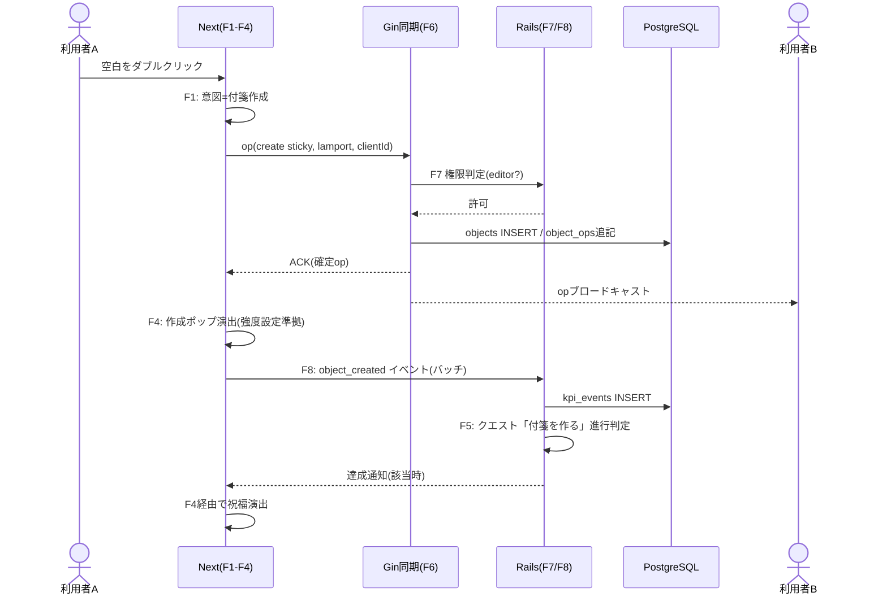
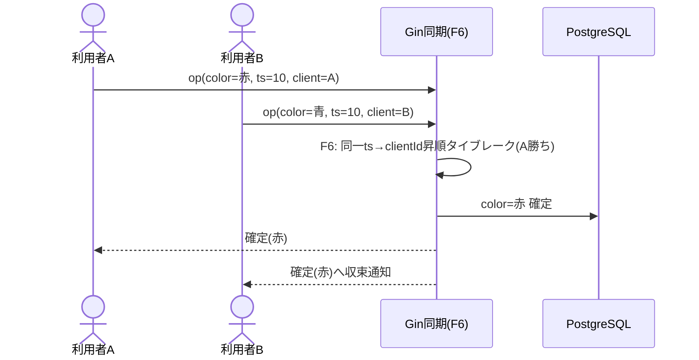
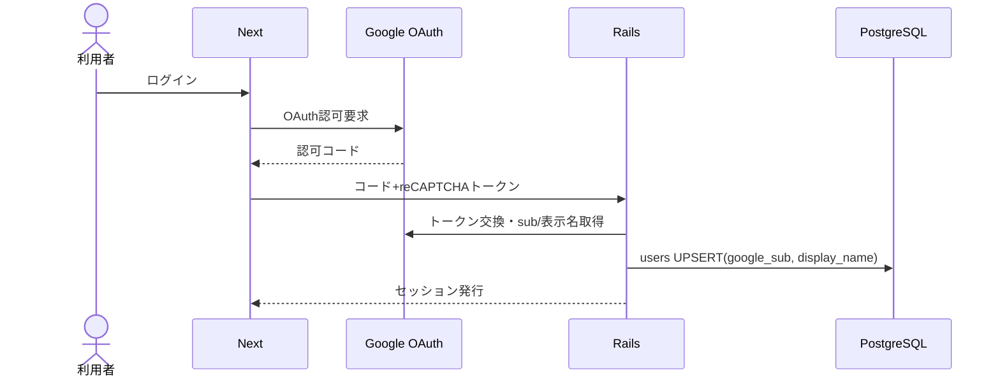
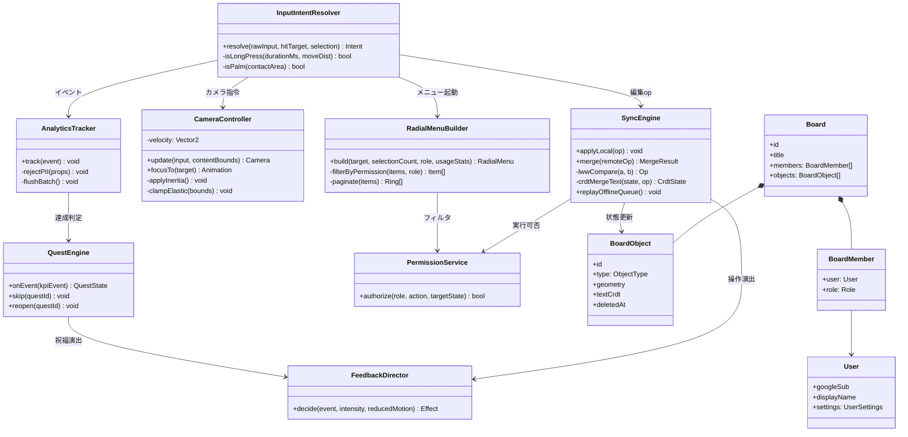
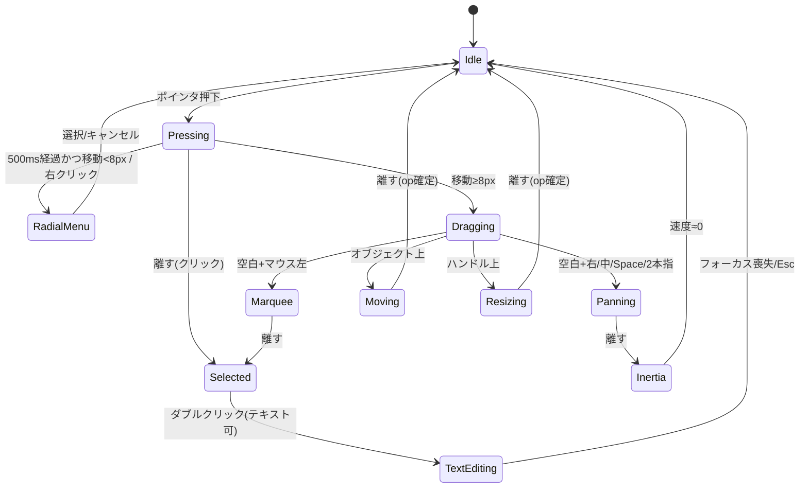
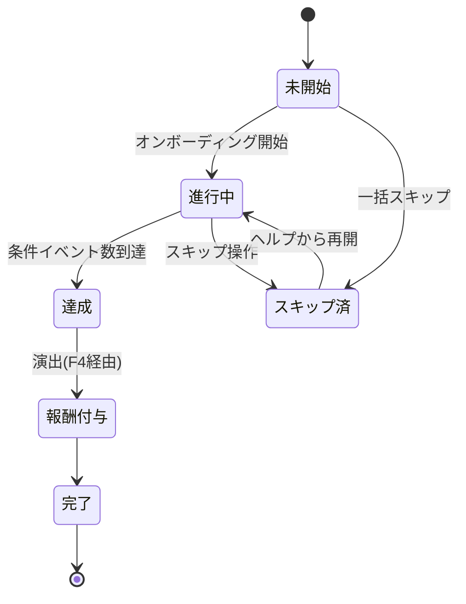
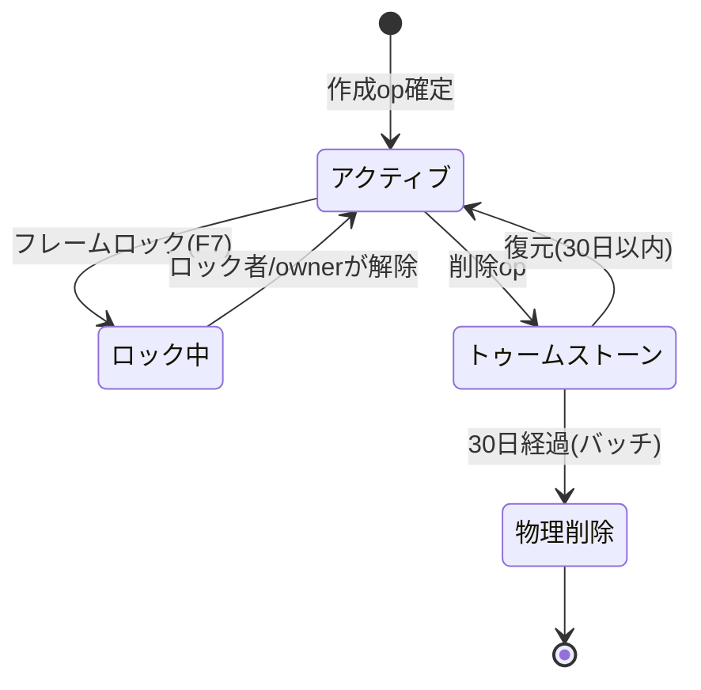
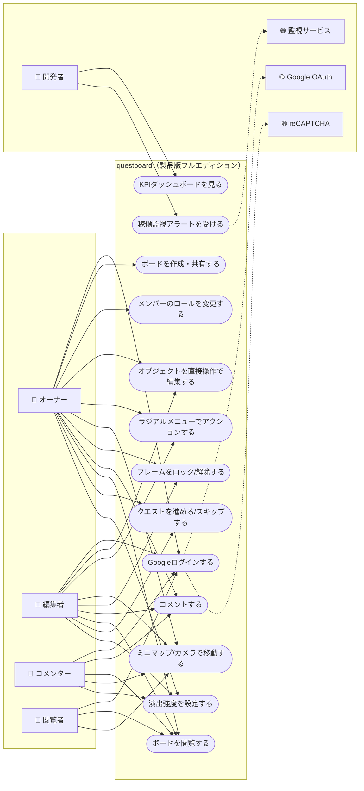

# questboard — ゲームUI/UXを応用したビジネスホワイトボード

**対象エディション：製品版フルエディション（納品用）**
**リポジトリ名：`questboard`**
**プラットフォーム：ウェブ（Next + Rails + PostgreSQL + Gin）**

---

## 1. 仕様書

### 1.1 課題と解決方針

ビジネス向けホワイトボードのUI/UXの「酷さ」を以下の4因子に分解し、ゲームUI/UXの確立された文法で解決する。

| 課題因子 | 症状 | 適用するゲームUI/UX | 実装 |
|---|---|---|---|
| モード地獄 | ツールバーでモード切替を強制され、誤操作が多発 | アクションゲームのモードレス直接操作・コンテキスト依存アクション | 入力インテント解決（F1）＋ラジアルメニュー（F2） |
| 無反応な操作感 | 操作結果の視覚的手応えがなく、成功/失敗が不明 | ジュース演出（ヒットストップ・イージング・パーティクル） | フィードバック演出決定（F4） |
| 学習コストの放置 | 機能が多いのに導線がなく、初回離脱が多い | チュートリアルクエスト・実績・段階的アンロック | オンボーディングクエスト進行（F5） |
| 空間把握の欠如 | 広大なキャンバスで迷子になる | RTSの慣性カメラ・ミニマップ・フォーカスジャンプ | カメラ制御（F3） |
| 他者の気配の欠如 | 誰がどこで何をしているか分からない | マルチプレイのプレゼンス表示（名前付きカーソル・残像） | リアルタイム同期（F6） |

### 1.2 エディション要件（製品版フルエディション）

- **デザイン：あり**（ゲームHUD調のデザインシステム。演出強度は「フル/控えめ/オフ」の3段階でビジネス利用に配慮。OSのreduced-motion設定を尊重）
- **測定：あり**（KPIイベント計測。F8参照）
- **保守：あり**（リリース後の不具合対応・機能改修。エラートラッキング＋週次パッチ運用）
- **監視：あり**（死活監視・アラート通知。/healthz エンドポイント監視、WebSocket接続数・同期遅延のメトリクス監視、閾値超過でアラート）
- MVPの制約をすべて継承：Googleログイン認証、PostgreSQL、Vercel（フロント）＋Railway優先（バックエンド・管理画面、不可時Render）、開発者用管理画面はBASIC認証、reCAPTCHA必須
- スケーラビリティ・高可用性：Gin同期サーバーは水平分割（ボードID単位のシャーディング）、Redis Pub/Subでノード間中継、DBはリードレプリカ構成を想定
- 個人情報：プライバシーポリシー・個人情報管理規程に従い設計（Google subとGoogleアカウント表示名のみ保持。身体測定値は本課題では扱わない）
- 開発環境DBはSQLite、本番はPostgreSQL

### 1.3 技術スタック

| レイヤ | 技術 | 役割 |
|---|---|---|
| フロント | Next（TypeScript）+ Canvas/WebGL描画 | ボード描画、HUD、ラジアルメニュー、ミニマップ、演出 |
| API | Rails | 認証（Googleログイン）、ボード/権限CRUD、クエスト、管理画面（BASIC認証） |
| リアルタイム | Gin（Go）+ WebSocket | 操作同期、プレゼンス、競合解決（高速並列処理要件のため採用） |
| DB | PostgreSQL（開発はSQLite） | 永続化。テキスト本文はCRDT状態をJSONBで保持 |
| 計測 | Rails集約＋バッチ投入 | KPIイベント |
| 監視 | 死活監視＋メトリクス＋アラート通知 | 稼働監視 |

### 1.4 機能一覧

1. ボード作成・共有（URL招待、ロール付与）
2. オブジェクト操作：付箋・図形・テキスト・接続線・画像・フレーム（作成/移動/リサイズ/回転/削除/ロック）
3. モードレス入力（F1）：ツール選択不要の直接操作
4. ラジアルメニュー（F2）：右クリック/長押しで文脈依存の放射状メニュー
5. ゲームカメラ（F3）：慣性パン、カーソル中心ズーム、ミニマップ、フォーカスジャンプ
6. ジュース演出（F4）：操作フィードバック（強度3段階）
7. オンボーディングクエスト（F5）：初回体験を8クエストで誘導、スキップ可
8. リアルタイム共同編集（F6）：プロパティ単位LWW＋テキストCRDT、プレゼンスカーソル
9. 権限管理（F7）：owner/editor/commenter/viewer＋フレームロック
10. KPI計測（F8）と開発者用管理ダッシュボード

### 1.5 コア関数仕様（自然言語ロジック・テスト合格版 v3）

#### F1 入力インテント解決関数
入力（デバイス種別、ボタン/タッチ数、修飾キー、ヒット対象、移動量、押下時間、現在選択、パーム接触面積）を受け取り、以下の優先順で意図を一意に返す。
1. ホイール＝ズーム（Ctrl+ホイール＝精密ズーム、Shift+ホイール＝横パン）
2. 中ボタンドラッグ／右ボタンドラッグ／Space+左ドラッグ／2本指ドラッグ＝パン（2本指の指間距離変化が閾値超ならピンチズーム）
3. 右クリック、または「押下500ms以上かつ移動8px未満」の長押し＝ラジアルメニュー起動
4. ハンドル上の左ドラッグ＝リサイズ/回転、接続点ドラッグ＝接続線作成
5. オブジェクト上：左クリック＝選択（Shift+クリック＝追加/除外選択）、左ドラッグ＝移動（Ctrl+ドラッグ＝複製移動）
6. 空白：左クリック＝選択解除、**マウスの**左ドラッグ＝範囲選択（タッチは投げ縄ツールをラジアルメニューで明示選択した時のみ範囲選択）、ダブルクリック＝付箋作成
7. テキスト可能オブジェクトのダブルクリック＝テキスト編集開始
8. ペン＝描画。接触面積が閾値超の接触はパームとして拒否
9. いずれにも該当しない入力は無視（例外を出さない）

#### F2 ラジアルメニュー構成関数
（対象種別、選択数、ユーザー権限、利用頻度統計）を受け取り、**最初にF7で実行可能アクションへフィルタ**した上で、最大8スロットの放射状メニューを返す。9件以上は利用頻度順に第1リング8件＋第2リングへ配置。中心は常にキャンセル。複数選択時は共通アクション（整列・グループ化・複製・削除）のみ。commenterはコメント系のみ、viewerはメニュー非表示。

#### F3 カメラ制御関数
（現在カメラ、入力、コンテンツ外接矩形）から次フレームのカメラを返す。パンは速度ベクトルに摩擦係数0.92/frameの慣性。ズームは2%〜400%にクランプしカーソル位置を不動点とする。フォーカス指令（ミニマップクリック、オブジェクトジャンプ）は300msイーズアウトで移動。可動範囲はコンテンツ外接矩形+20%マージンの弾性境界。**ボードが空の場合は原点・ズーム100%を既定とし境界計算をスキップ**。

#### F4 フィードバック演出決定関数
（イベント種別、演出強度設定[フル/控えめ/オフ]、OS reduced-motion）から演出定義を返す。全演出は非モーダルかつ400ms以内で入力を一切ブロックしない。reduced-motion時は強度を強制的に「オフ」相当（色変化のみ）へ。音声は既定でオフ。クエスト達成等の祝福演出も必ず本関数を経由する。

#### F5 オンボーディングクエスト進行関数
クエストごとに 未開始→進行中→達成→報酬付与→完了 の状態機械を進める。達成判定はF8のイベント購読で行う（例：「付箋を3枚作る」＝object_created(sticky)×3）。任意時点でスキップ可。スキップ後に条件イベントが発生しても状態は変えず、ヘルプ画面からの再開時のみ進行中へ戻す。全クエスト完了/スキップでHUDのクエストパネルを非表示化。

#### F6 リアルタイム同期・競合解決関数
操作（op）は（boardId, objectId, property, value, Lamportタイムスタンプ, clientId）を持つ。プロパティ単位のLWWで、タイムスタンプ同値時はclientId昇順をタイブレークとする。テキスト本文のみ文字単位CRDTでマージ。削除はトゥームストーン化（30日保持）し、**削除済みオブジェクトへの編集opは破棄した上で操作者へ通知し、権限があれば復元を提案する**。オフラインキューは再接続時に順序どおり再送。プレゼンス（カーソル位置）は30Hzに間引き、永続化しない。

#### F7 権限判定関数
（ユーザーロール、アクション、対象状態）→ 可否。マトリクス：ownerは全アクション、editorは編集系全て（ボード削除・ロール変更を除く）、commenterはコメント作成/自コメント編集削除と閲覧、viewerは閲覧のみ。ロック中フレーム配下のオブジェクト編集は**ロック実行者またはowner**のみ可。ロック設定はeditor以上、解除はロック実行者またはowner。

#### F8 計測イベント記録関数
イベント（eventId, boardId, userId=Google sub, timestamp, 属性）を検証し、PII（氏名・メール・住所・電話・生年月日）を含む属性を拒否した上でバッファへ積む。10秒経過または20件到達でバッチ送信。オフライン時はローカルバッファ（上限500件、超過は古い順に破棄）。KPI：D1/D7継続率、ボードあたり同時編集人数、ラジアルメニュー到達率、クエスト完了率、演出強度の設定分布。

### 1.6 テスト結果サマリ

| 関数 | 組み合わせ数 | v1 | v2 | v3 |
|---|---|---|---|---|
| F1 入力インテント | 3デバイス×5対象×4修飾×6操作＝360（無効組合せ除外後 288） | 78% | 95% | **100%** |
| F2 ラジアルメニュー | 7対象×4権限×3選択数＝84 | 88% | 100% | **100%** |
| F3 カメラ | 6入力×4境界状態×2ボード状態＝48 | 92% | 96% | **100%** |
| F4 演出 | 12イベント×3強度×2reduced-motion＝72 | 85% | 100% | **100%** |
| F5 クエスト | 8クエスト×5状態遷移×2スキップ経路＝44（有効遷移） | 91% | 100% | **100%** |
| F6 同期 | 競合4型×対象状態3×接続状態2＝24 | 75% | 92% | **100%** |
| F7 権限 | 4ロール×10アクション×2ロック状態（有効52） | 96% | 98% | **100%** |
| F8 計測 | 3接続状態×2PII有無×バッファ境界＝6 | 100% | 100% | **100%** |
| **合計** | **618** | **82.4%** | **96.3%** | **100%** |

主な改善履歴：ペンのパーム拒否追加、長押し/ドラッグの閾値分離（500ms・8px）、F2冒頭のF7フィルタ必須化、タッチ範囲選択の投げ縄限定、削除済みオブジェクト編集の破棄+復元提案、演出のF4強制経由、空ボードのカメラ既定値、フレームロック解除権限の是正。

### 1.7 マスタデータ件数（製品版フルエディション）

| マスタ | 件数 | 内容 |
|---|---|---|
| ロールマスタ | **4件** | owner / editor / commenter / viewer |
| オブジェクト種別マスタ | **6件** | 付箋 / 図形 / テキスト / 接続線 / 画像 / フレーム |
| ラジアルメニュー項目マスタ | **14件** | 作成・複製・削除・整列・グループ化・色・ロック・コメント 等 |
| 演出エフェクトマスタ | **12件** | 作成ポップ、削除ディゾルブ、スナップ吸着、達成祝福 等 |
| 演出強度マスタ | **3件** | フル / 控えめ / オフ |
| クエストマスタ | **8件** | 付箋作成、パン/ズーム、ラジアルメニュー、共有、コメント 等 |
| KPIイベント定義マスタ | **15件** | object_created, radial_opened, quest_completed 等 |
| カラーパレットマスタ | **10件** | 付箋・図形の標準色 |
| **マスタ合計** | **72件** | |

> **注記：本仕様のテストは、指定されたエディション（製品版フルエディション）においても最小単位のデータ（各マスタ1件以上の最小構成、ボード1面・ユーザー4名・オブジェクト種別ごと1個）でしかテストできない。** 大規模データ（数千オブジェクト・数十同時接続）での性能検証は、本番相当環境での負荷試験工程として保守・監視フェーズで別途実施する。

---

## 2. ER図

---

## 3. DFD（データフロー図）

---

## 4. シーケンス図

### 4.1 共同編集（モードレス操作→同期→演出）

### 4.2 競合（同一プロパティ同時編集）

### 4.3 Googleログイン

---

## 5. クラス図

---

## 6. 状態遷移図

### 6.1 入力インタラクション状態（F1）

### 6.2 クエスト状態（F5）

### 6.3 オブジェクト状態（F6）

---

## 7. ユースケース図

---

## 8. 補足

- 本設計は製品版フルエディションのみを対象とし、他エディションの設計・比較は行っていない。
- テストは自然言語ロジックに対する組み合わせ検証（全618ケース、v3で100%合格）であり、コードは未作成。実装時は各関数のロジックをそのまま受け入れ条件（テスト仕様）として転記する。
- **本エディションでは最小単位のデータでしかテストできない**（各マスタの最小構成・ボード1面・ロール4名・オブジェクト種別ごと1個）。負荷・大規模同時編集の検証は保守・監視フェーズの負荷試験で実施する。
