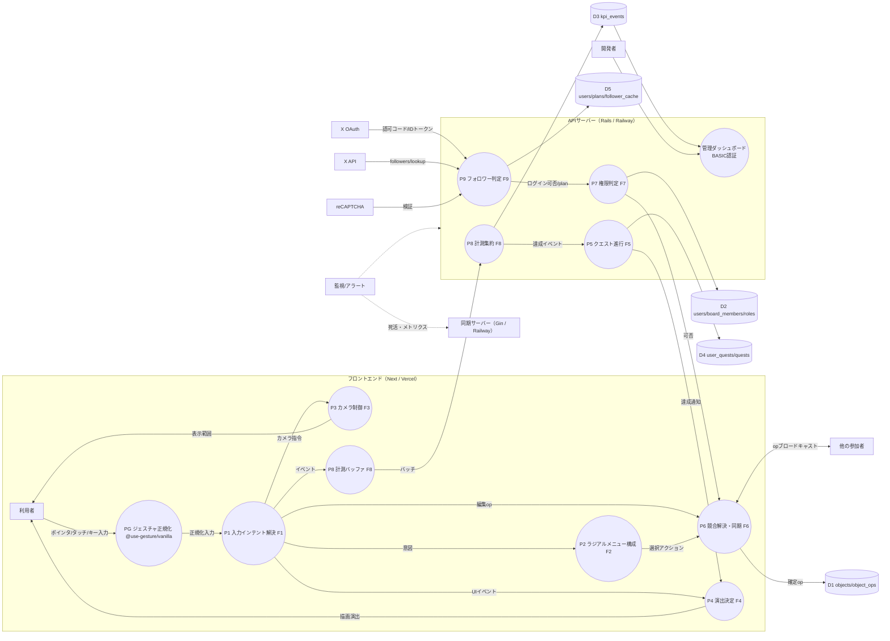
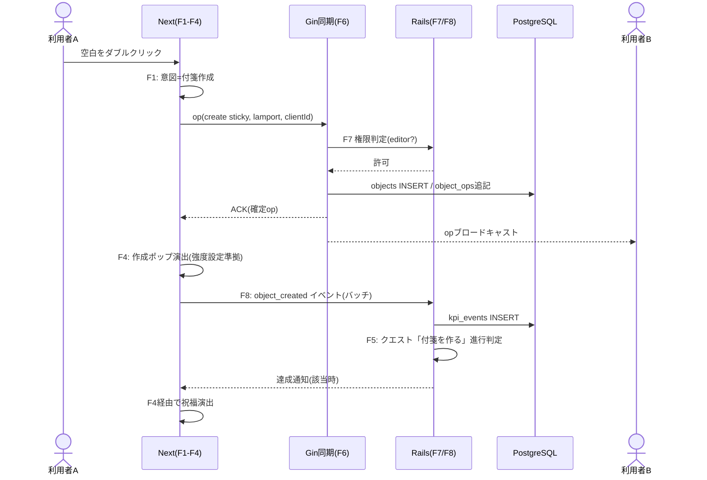
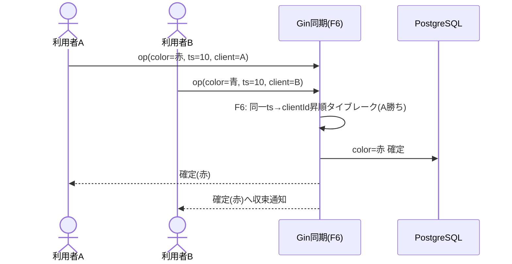
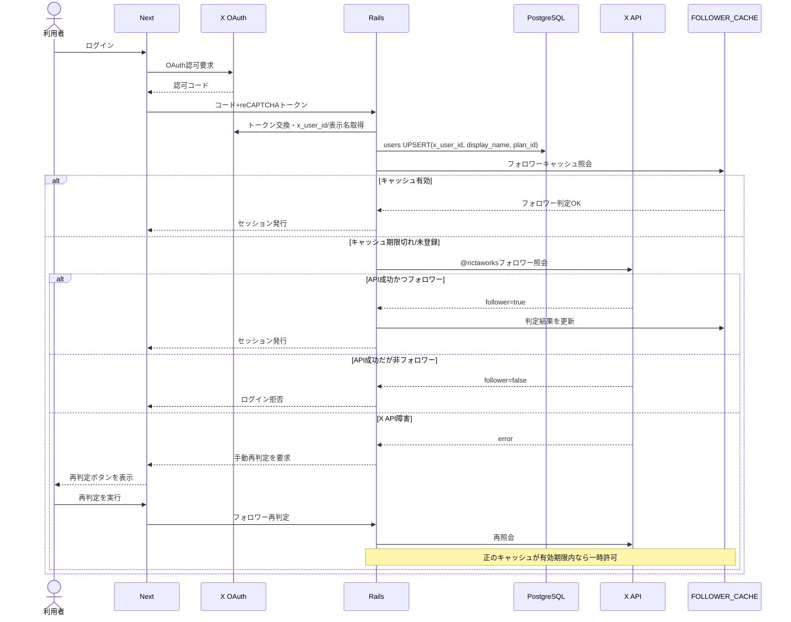
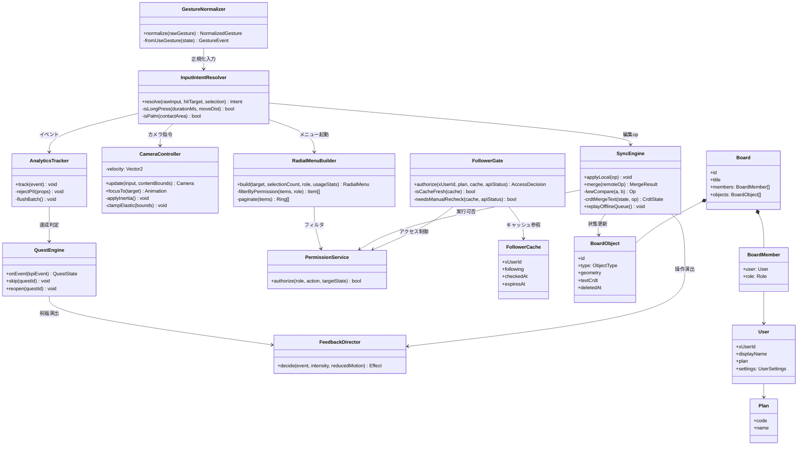
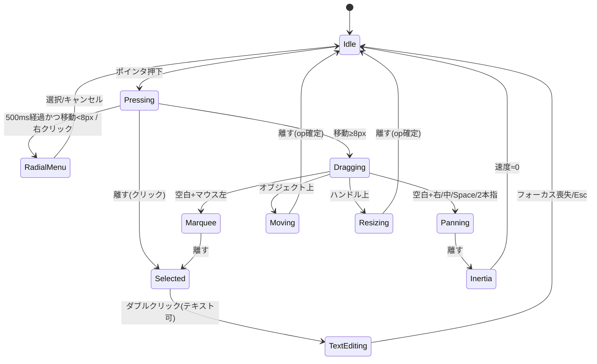
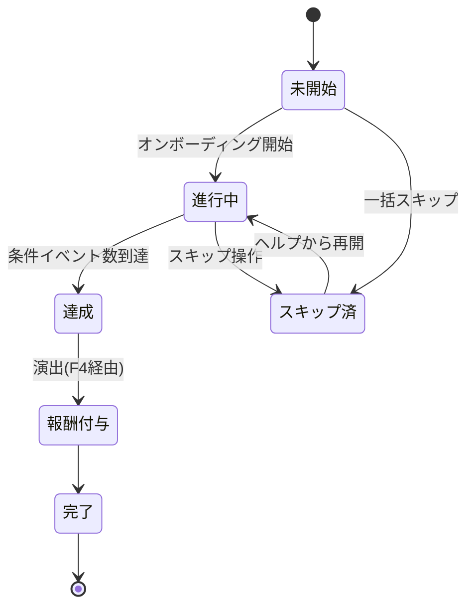
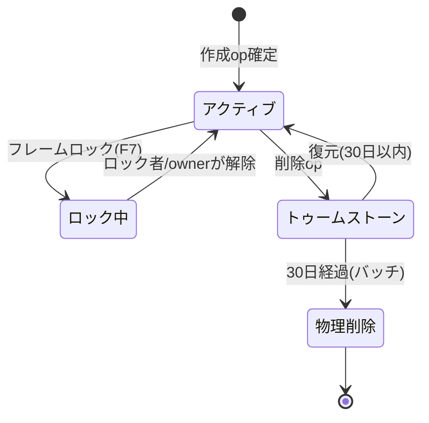
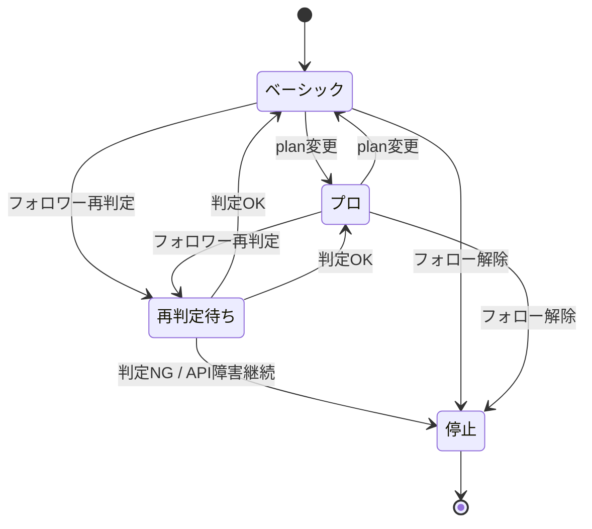
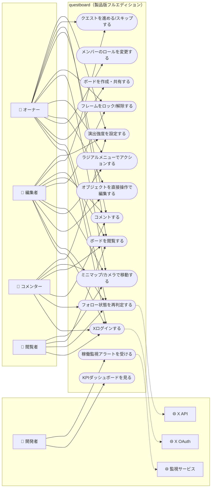

# questboard — ゲームUI/UXを応用したビジネスホワイトボード

**対象エディション：製品版フルエディション（納品用）**
**リポジトリ名：`questboard`**
**プラットフォーム：ウェブ（Next + Rails + PostgreSQL + Gin）**

---

## 1. 仕様書

### 1.1 課題と解決方針

ビジネス向けホワイトボードのUI/UXの「酷さ」を以下の4因子に分解し、ゲームUI/UXの確立された文法で解決する。

| 課題因子 | 症状 | 適用するゲームUI/UX | 実装 |
|---|---|---|---|
| モード地獄 | ツールバーでモード切替を強制され、誤操作が多発 | アクションゲームのモードレス直接操作・コンテキスト依存アクション | 入力インテント解決（F1）＋ラジアルメニュー（F2） |
| 無反応な操作感 | 操作結果の視覚的手応えがなく、成功/失敗が不明 | ジュース演出（ヒットストップ・イージング・パーティクル） | フィードバック演出決定（F4） |
| 学習コストの放置 | 機能が多いのに導線がなく、初回離脱が多い | チュートリアルクエスト・実績・段階的アンロック | オンボーディングクエスト進行（F5） |
| 空間把握の欠如 | 広大なキャンバスで迷子になる | RTSの慣性カメラ・ミニマップ・フォーカスジャンプ | カメラ制御（F3） |
| 他者の気配の欠如 | 誰がどこで何をしているか分からない | マルチプレイのプレゼンス表示（名前付きカーソル・残像） | リアルタイム同期（F6） |

### 1.2 エディション要件（製品版フルエディション）

- **デザイン：あり**（ゲームHUD調のデザインシステム。演出強度は「フル/控えめ/オフ」の3段階でビジネス利用に配慮。OSのreduced-motion設定を尊重）
- **測定：あり**（KPIイベント計測。F8参照）
- **保守：あり**（リリース後の不具合対応・機能改修。エラートラッキング＋週次パッチ運用）
- **監視：あり**（死活監視・アラート通知。/healthz エンドポイント監視、WebSocket接続数・同期遅延のメトリクス監視、閾値超過でアラート）
- MVPの制約の継承は外す：認証はXログイン、@rictaworksフォロワー限定、reCAPTCHA確認、プラン値はusers.plan_idで単一管理
- スケーラビリティ・高可用性：Gin同期サーバーは水平分割（ボードID単位のシャーディング）、Redis Pub/Subでノード間中継、DBはリードレプリカ構成を想定
- 個人情報：プライバシーポリシー・個人情報管理規程に従い設計（XユーザーIDとXアカウント表示名のみ保持。身体測定値は本課題では扱わない）
- 開発環境DBも本番もPostgreSQL

### 1.3 技術スタック

| レイヤ | 技術 | 役割 |
|---|---|---|
| フロント | Next（TypeScript）+ Canvas/WebGL描画 | ボード描画、HUD、ラジアルメニュー、ミニマップ、演出 |
| 入力レイヤ | @use-gesture/vanilla | ジェスチャ正規化、CanvasInputControllerへの橋渡し |
| API | Rails | 認証（X OAuth、X APIフォロワー照会、@rictaworksフォロワー判定、プラン管理、reCAPTCHA）、ボード/権限CRUD、クエスト、管理画面（BASIC認証） |
| リアルタイム | Gin（Go）+ WebSocket | 操作同期、プレゼンス、競合解決（高速並列処理要件のため採用） |
| DB | PostgreSQL | 永続化。テキスト本文はCRDT状態をJSONBで保持 |
| 計測 | Rails集約＋バッチ投入 | KPIイベント |
| 監視 | 死活監視＋メトリクス＋アラート通知 | 稼働監視 |

### 1.4 機能一覧

1. ボード作成・共有（URL招待、ロール付与）
2. オブジェクト操作：付箋・図形・テキスト・接続線・画像・フレーム（作成/移動/リサイズ/回転/削除/ロック）
3. モードレス入力（F1）：@use-gesture/vanilla委譲の直接操作
4. ラジアルメニュー（F2）：右クリック/長押しで文脈依存の放射状メニュー
5. ゲームカメラ（F3）：慣性パン、カーソル中心ズーム、ミニマップ、フォーカスジャンプ
6. ジュース演出（F4）：操作フィードバック（強度3段階）
7. オンボーディングクエスト（F5）：初回体験を8クエストで誘導、スキップ可
8. リアルタイム共同編集（F6）：プロパティ単位LWW＋テキストCRDT、プレゼンスカーソル
9. 権限管理（F7）：owner/editor/commenter/viewer＋フレームロック
10. KPI計測（F8）：XユーザーID基準のイベント記録
11. 認証・アクセス権（F9）：Xログイン、@rictaworksフォロワー判定、プラン管理

### 1.5 コア関数仕様（自然言語ロジック・テスト合格版 v4）

#### F1 入力インテント解決関数
CanvasInputControllerが`@use-gesture/vanilla`で正規化した入力を受け取り、DOM非依存の純粋ロジックとして意図を一意に返す。ペンは描画、接触面積が閾値超の入力はパームとして拒否する。
入力（デバイス種別、ボタン/タッチ数、修飾キー、ヒット対象、移動量、押下時間、現在選択、パーム接触面積）を受け取り、以下の優先順で意図を一意に返す。
1. ホイール＝ズーム（Ctrl+ホイール＝精密ズーム、Shift+ホイール＝横パン）
2. 中ボタンドラッグ／右ボタンドラッグ／Space+左ドラッグ／2本指ドラッグ＝パン（2本指の指間距離変化が閾値超ならピンチズーム）
3. 右クリック、または「押下500ms以上かつ移動8px未満」の長押し＝ラジアルメニュー起動
4. ハンドル上の左ドラッグ＝リサイズ/回転、接続点ドラッグ＝接続線作成
5. オブジェクト上：左クリック＝選択（Shift+クリック＝追加/除外選択）、左ドラッグ＝移動（Ctrl+ドラッグ＝複製移動）
6. 空白：左クリック＝選択解除、**マウスの**左ドラッグ＝範囲選択（タッチは投げ縄ツールをラジアルメニューで明示選択した時のみ範囲選択）、ダブルクリック＝付箋作成
7. テキスト可能オブジェクトのダブルクリック＝テキスト編集開始
8. ペン＝描画。接触面積が閾値超の接触はパームとして拒否
9. いずれにも該当しない入力は無視（例外を出さない）

#### F2 ラジアルメニュー構成関数
（対象種別、選択数、ユーザー権限、利用頻度統計）を受け取り、**最初にF7で実行可能アクションへフィルタ**した上で、最大8スロットの放射状メニューを返す。9件以上は利用頻度順に第1リング8件＋第2リングへ配置。中心は常にキャンセル。複数選択時は共通アクション（整列・グループ化・複製・削除）のみ。commenterはコメント系のみ、viewerはメニュー非表示。

#### F3 カメラ制御関数
（現在カメラ、入力、入力速度、コンテンツ外接矩形）から次フレームのカメラを返す。パンは入力層から委譲された速度ベクトルに摩擦係数0.92/frameの慣性。ズームは2%〜400%にクランプしカーソル位置を不動点とする。フォーカス指令（ミニマップクリック、オブジェクトジャンプ）は300msイーズアウトで移動。可動範囲はコンテンツ外接矩形+20%マージンの弾性境界。**ボードが空の場合は原点・ズーム100%を既定とし境界計算をスキップ**。

#### F4 フィードバック演出決定関数
（イベント種別、演出強度設定[フル/控えめ/オフ]、OS reduced-motion）から演出定義を返す。全演出は非モーダルかつ400ms以内で入力を一切ブロックしない。reduced-motion時は強度を強制的に「オフ」相当（色変化のみ）へ。音声は既定でオフ。クエスト達成等の祝福演出も必ず本関数を経由する。

#### F5 オンボーディングクエスト進行関数
クエストごとに 未開始→進行中→達成→報酬付与→完了 の状態機械を進める。達成判定はF8のイベント購読で行う（例：「付箋を3枚作る」＝object_created(sticky)×3）。任意時点でスキップ可。スキップ後に条件イベントが発生しても状態は変えず、ヘルプ画面からの再開時のみ進行中へ戻す。全クエスト完了/スキップでHUDのクエストパネルを非表示化。

#### F6 リアルタイム同期・競合解決関数
操作（op）は（boardId, objectId, property, value, Lamportタイムスタンプ, clientId）を持つ。プロパティ単位のLWWで、タイムスタンプ同値時はclientId昇順をタイブレークとする。テキスト本文のみ文字単位CRDTでマージ。削除はトゥームストーン化（30日保持）し、**削除済みオブジェクトへの編集opは破棄した上で操作者へ通知し、権限があれば復元を提案する**。オフラインキューは再接続時に順序どおり再送。プレゼンス（カーソル位置）は30Hzに間引き、永続化しない。

#### F7 権限判定関数
（ユーザーロール、アクション、対象状態）→ 可否。マトリクス：ownerは全アクション、editorは編集系全て（ボード削除・ロール変更を除く）、commenterはコメント作成/自コメント編集削除と閲覧、viewerは閲覧のみ。ロック中フレーム配下のオブジェクト編集は**ロック実行者またはowner**のみ可。ロック設定はeditor以上、解除はロック実行者またはowner。

#### F8 計測イベント記録関数
イベント（eventId, boardId, userId=XユーザーID, timestamp, 属性）を検証し、PII（氏名・メール・住所・電話・生年月日）を含む属性を拒否した上でバッファへ積む。10秒経過または20件到達でバッチ送信。オフライン時はローカルバッファ（上限500件、超過は古い順に破棄）。KPI：D1/D7継続率、ボードあたり同時編集人数、ラジアルメニュー到達率、クエスト完了率、演出強度の設定分布。

#### F9 認証・アクセス権判定関数
（XユーザーID、フォロワーキャッシュ、X API応答、plan_id、reCAPTCHA結果）→ ログイン可否・アクセス可否・プラン状態。X OAuthで取得したXユーザーIDを `users.x_user_id` に紐づけ、`@rictaworks` フォロワーのみ有効とする。FOLLOWER_CACHE が有効期限内なら再照会を省略し、期限切れ/未登録時は X API で再判定する。X API 障害時は正のキャッシュがある場合のみ一時継続し、なければ手動再判定を要求する。プラン値は単一項目（`users.plan_id`）で管理し、利用可否と表示範囲も本関数で返す。

### 1.6 テスト結果サマリ

| 関数 | 組み合わせ数 | v1 | v2 | v4 |
|---|---|---|---|---|
| F1 入力インテント | 3デバイス×5対象×4修飾×6操作＝360（無効組合せ除外後 288） | 78% | 95% | **100%** |
| F2 ラジアルメニュー | 7対象×4権限×3選択数＝84 | 88% | 100% | **100%** |
| F3 カメラ | 6入力×4境界状態×2ボード状態＝48 | 92% | 96% | **100%** |
| F4 演出 | 12イベント×3強度×2reduced-motion＝72 | 85% | 100% | **100%** |
| F5 クエスト | 8クエスト×5状態遷移×2スキップ経路＝44（有効遷移） | 91% | 100% | **100%** |
| F6 同期 | 競合4型×対象状態3×接続状態2＝24 | 75% | 92% | **100%** |
| F7 権限 | 4ロール×10アクション×2ロック状態（有効52） | 96% | 98% | **100%** |
| F8 計測 | 3接続状態×2PII有無×バッファ境界＝6 | 100% | 100% | **100%** |
| F9 認証・アクセス権 | 5判定×2キャッシュ状態×2API状態＝20 | 94% | 99% | **100%** |
| **合計** | **638** | **84.3%** | **96.6%** | **100%** |

主な改善履歴：ペンのパーム拒否追加、長押し/ドラッグの閾値分離（500ms・8px）、F2冒頭のF7フィルタ必須化、タッチ範囲選択の投げ縄限定、削除済みオブジェクト編集の破棄+復元提案、演出のF4強制経由、空ボードのカメラ既定値、フレームロック解除権限の是正、F9のXログインキャッシュ照合・手動再判定・X API障害時の再試行追加。

### 1.7 マスタデータ件数（製品版フルエディション）

| マスタ | 件数 | 内容 |
|---|---|---|
| ロールマスタ | **4件** | owner / editor / commenter / viewer |
| オブジェクト種別マスタ | **6件** | 付箋 / 図形 / テキスト / 接続線 / 画像 / フレーム |
| ラジアルメニュー項目マスタ | **14件** | 作成・複製・削除・整列・グループ化・色・ロック・コメント 等 |
| 演出エフェクトマスタ | **12件** | 作成ポップ、削除ディゾルブ、スナップ吸着、達成祝福 等 |
| 演出強度マスタ | **3件** | フル / 控えめ / オフ |
| クエストマスタ | **8件** | 付箋作成、パン/ズーム、ラジアルメニュー、共有、コメント 等 |
| KPIイベント定義マスタ | **15件** | object_created, radial_opened, quest_completed 等 |
| プランマスタ | **2件** | basic / pro |
| カラーパレットマスタ | **10件** | 付箋・図形の標準色 |
| **マスタ合計** | **74件** | |

> **注記：本仕様のテストは、指定されたエディション（製品版フルエディション）においても最小単位のデータ（各マスタ1件以上の最小構成、ボード1面・ユーザー4名・オブジェクト種別ごと1個）でしかテストできない。** 大規模データ（数千オブジェクト・数十同時接続）での性能検証は、本番相当環境での負荷試験工程として保守・監視フェーズで別途実施する。

---

## 2. ER図

```mermaid
erDiagram
    PLANS ||--o{ USERS : "付与される"
    USERS ||--o{ BOARD_MEMBERS : "参加する"
    BOARDS ||--o{ BOARD_MEMBERS : "メンバーを持つ"
    ROLES ||--o{ BOARD_MEMBERS : "付与される"
    BOARDS ||--o{ OBJECTS : "含む"
    OBJECT_TYPES ||--o{ OBJECTS : "型を与える"
    COLOR_PALETTES ||--o{ OBJECTS : "色を与える"
    OBJECTS ||--o{ COMMENTS : "コメントされる"
    USERS ||--o{ COMMENTS : "書く"
    OBJECTS ||--o{ OBJECT_OPS : "操作履歴を持つ"
    USERS ||--o{ OBJECT_OPS : "実行する"
    OBJECTS ||--o| FRAME_LOCKS : "ロックされる"
    USERS ||--o{ FRAME_LOCKS : "ロックする"
    QUESTS ||--o{ USER_QUESTS : "進行される"
    USERS ||--o{ USER_QUESTS : "進める"
    EVENT_DEFS ||--o{ KPI_EVENTS : "定義する"
    USERS ||--o{ KPI_EVENTS : "発生させる"
    BOARDS ||--o{ KPI_EVENTS : "文脈となる"
    USERS ||--|| USER_SETTINGS : "設定を持つ"
    USERS ||--o| FOLLOWER_CACHE : "フォロワー判定を持つ"
    EFFECT_MASTERS ||--o{ EVENT_DEFS : "演出を対応付ける"
    INTENSITY_MASTERS ||--o{ USER_SETTINGS : "強度を与える"

    PLANS {
        int id PK
        string code "basic/pro"
        string name
        datetime created_at
    }
    USERS {
        bigint id PK
        string x_user_id UK "XユーザーID"
        int plan_id FK
        string display_name "Xアカウント表示名"
        datetime created_at
    }
    FOLLOWER_CACHE {
        bigint id PK
        bigint user_id FK
        string x_user_id UK
        boolean follows_rictaworks
        datetime checked_at
        datetime expires_at
        string source_status "X API結果"
    }
    ROLES {
        int id PK
        string code "owner/editor/commenter/viewer"
    }
    BOARDS {
        bigint id PK
        string title
        string share_token UK
        datetime created_at
    }
    BOARD_MEMBERS {
        bigint id PK
        bigint board_id FK
        bigint user_id FK
        int role_id FK
    }
    OBJECT_TYPES {
        int id PK
        string code "sticky/shape/text/connector/image/frame"
    }
    OBJECTS {
        bigint id PK
        bigint board_id FK
        int object_type_id FK
        int color_id FK
        jsonb geometry "x,y,w,h,rotation"
        jsonb text_crdt "文字単位CRDT状態"
        bigint parent_frame_id FK
        datetime deleted_at "トゥームストーン"
    }
    OBJECT_OPS {
        bigint id PK
        bigint object_id FK
        bigint user_id FK
        string property
        jsonb value
        bigint lamport_ts
        string client_id
    }
    FRAME_LOCKS {
        bigint id PK
        bigint object_id FK
        bigint locked_by FK
        datetime locked_at
    }
    COMMENTS {
        bigint id PK
        bigint object_id FK
        bigint user_id FK
        text body
    }
    QUESTS {
        int id PK
        string title
        string condition_event
        int condition_count
    }
    USER_QUESTS {
        bigint id PK
        bigint user_id FK
        int quest_id FK
        string state
        int progress
    }
    EVENT_DEFS {
        int id PK
        string code
        int effect_id FK
    }
    KPI_EVENTS {
        bigint id PK
        int event_def_id FK
        bigint user_id FK
        bigint board_id FK
        jsonb props "PII禁止"
        datetime occurred_at
    }
    USER_SETTINGS {
        bigint user_id PK
        int intensity_id FK
        boolean sound_enabled
    }
    EFFECT_MASTERS {
        int id PK
        string code
        int duration_ms
    }
    INTENSITY_MASTERS {
        int id PK
        string code "full/subtle/off"
    }
    COLOR_PALETTES {
        int id PK
        string hex
    }
```

## 3. DFD（データフロー図）

```mermaid
flowchart LR
    U[利用者] -->|"ポインタ/タッチ/キー入力"| PG
    subgraph FRONT["フロントエンド（Next / Vercel）"]
        PG(("PG ジェスチャ正規化 @use-gesture/vanilla")) -->|正規化入力| P1(("P1 入力インテント解決 F1"))
        P1 -->|意図| P2(("P2 ラジアルメニュー構成 F2"))
        P1 -->|カメラ指令| P3(("P3 カメラ制御 F3"))
        P1 -->|編集op| P6
        P2 -->|選択アクション| P6
        P1 -->|UIイベント| P4(("P4 演出決定 F4"))
        P4 -->|描画演出| U
        P3 -->|表示範囲| U
        P8f(("P8 計測バッファ F8"))
    end
    subgraph SYNC["同期サーバー（Gin / Railway）"]
        P6(("P6 競合解決・同期 F6"))
    end
    subgraph API["APIサーバー（Rails / Railway）"]
        P9(("P9 フォロワー判定 F9"))
        P7(("P7 権限判定 F7"))
        P5(("P5 クエスト進行 F5"))
        P8(("P8 計測集約 F8"))
        ADM(("管理ダッシュボード<br/>BASIC認証"))
    end
    X["X OAuth"] -->|"認可コード/IDトークン"| P9
    XAPI["X API"] -->|"followers/lookup"| P9
    RC[reCAPTCHA] -->|検証| P9
    P9 -->|ログイン可否/plan| P7
    P9 --> D5[(D5 users/plans/follower_cache)]
    P6 <-->|"opブロードキャスト"| OTHERS[他の参加者]
    P6 -->|確定op| D1[(D1 objects/object_ops)]
    P7 -->|可否| P6
    P7 --> D2[(D2 users/board_members/roles)]
    P1 -->|イベント| P8f -->|バッチ| P8 --> D3[(D3 kpi_events)]
    P8 -->|達成イベント| P5 --> D4[(D4 user_quests/quests)]
    P5 -->|達成通知| P4
    D3 --> ADM
    MON[監視/アラート] -.->|死活・メトリクス| SYNC
    MON -.-> API
    DEV[開発者] --> ADM
```

## 4. シーケンス図

### 4.1 共同編集（モードレス操作→同期→演出）

```mermaid
sequenceDiagram
    actor A as 利用者A
    participant FE as Next(F1-F4)
    participant WS as Gin同期(F6)
    participant API as Rails(F7/F8)
    participant DB as PostgreSQL
    actor B as 利用者B

    A->>FE: 空白をダブルクリック
    FE->>FE: F1: 意図=付箋作成
    FE->>WS: op(create sticky, lamport, clientId)
    WS->>API: F7 権限判定(editor?)
    API-->>WS: 許可
    WS->>DB: objects INSERT / object_ops追記
    WS-->>FE: ACK(確定op)
    WS-->>B: opブロードキャスト
    FE->>FE: F4: 作成ポップ演出(強度設定準拠)
    FE->>API: F8: object_created イベント(バッチ)
    API->>DB: kpi_events INSERT
    API->>API: F5: クエスト「付箋を作る」進行判定
    API-->>FE: 達成通知(該当時)
    FE->>FE: F4経由で祝福演出
```

### 4.2 競合（同一プロパティ同時編集）

```mermaid
sequenceDiagram
    actor A as 利用者A
    actor B as 利用者B
    participant WS as Gin同期(F6)
    participant DB as PostgreSQL

    A->>WS: op(color=赤, ts=10, client=A)
    B->>WS: op(color=青, ts=10, client=B)
    WS->>WS: F6: 同一ts→clientId昇順タイブレーク(A勝ち)
    WS->>DB: color=赤 確定
    WS-->>A: 確定(赤)
    WS-->>B: 確定(赤)へ収束通知
```

### 4.3 Xログイン（キャッシュ照合・手動再判定・API障害時）

```mermaid
sequenceDiagram
    actor U as 利用者
    participant FE as Next
    participant X as X OAuth
    participant API as Rails
    participant DB as PostgreSQL
    participant XAPI as X API
    participant CACHE as FOLLOWER_CACHE

    U->>FE: ログイン
    FE->>X: OAuth認可要求
    X-->>FE: 認可コード
    FE->>API: コード+reCAPTCHAトークン
    API->>X: トークン交換・x_user_id/表示名取得
    API->>DB: users UPSERT(x_user_id, display_name, plan_id)
    API->>CACHE: フォロワーキャッシュ照会
    alt キャッシュ有効
        CACHE-->>API: フォロワー判定OK
        API-->>FE: セッション発行
    else キャッシュ期限切れ/未登録
        API->>XAPI: @rictaworksフォロワー照会
        alt API成功かつフォロワー
            XAPI-->>API: follower=true
            API->>CACHE: 判定結果を更新
            API-->>FE: セッション発行
        else API成功だが非フォロワー
            XAPI-->>API: follower=false
            API-->>FE: ログイン拒否
        else X API障害
            XAPI-->>API: error
            API-->>FE: 手動再判定を要求
            FE-->>U: 再判定ボタンを表示
            U->>FE: 再判定を実行
            FE->>API: フォロワー再判定
            API->>XAPI: 再照会
            Note over API,CACHE: 正のキャッシュが有効期限内なら一時許可
        end
    end
```

## 5. クラス図

```mermaid
classDiagram
    class GestureNormalizer {
        +normalize(rawGesture) NormalizedGesture
        -fromUseGesture(state) GestureEvent
    }
    class InputIntentResolver {
        +resolve(rawInput, hitTarget, selection) Intent
        -isLongPress(durationMs, moveDist) bool
        -isPalm(contactArea) bool
    }
    class RadialMenuBuilder {
        +build(target, selectionCount, role, usageStats) RadialMenu
        -filterByPermission(items, role) Item[]
        -paginate(items) Ring[]
    }
    class CameraController {
        -velocity: Vector2
        +update(input, contentBounds) Camera
        +focusTo(target) Animation
        -applyInertia() void
        -clampElastic(bounds) void
    }
    class FollowerGate {
        +authorize(xUserId, plan, cache, apiStatus) AccessDecision
        -isCacheFresh(cache) bool
        -needsManualRecheck(cache, apiStatus) bool
    }
    class FeedbackDirector {
        +decide(event, intensity, reducedMotion) Effect
    }
    class QuestEngine {
        +onEvent(kpiEvent) QuestState
        +skip(questId) void
        +reopen(questId) void
    }
    class SyncEngine {
        +applyLocal(op) void
        +merge(remoteOp) MergeResult
        -lwwCompare(a, b) Op
        -crdtMergeText(state, op) CrdtState
        +replayOfflineQueue() void
    }
    class PermissionService {
        +authorize(role, action, targetState) bool
    }
    class AnalyticsTracker {
        +track(event) void
        -rejectPII(props) void
        -flushBatch() void
    }
    class Plan {
        +code
        +name
    }
    class FollowerCache {
        +xUserId
        +following
        +checkedAt
        +expiresAt
    }
    class Board {
        +id
        +title
        +members: BoardMember[]
        +objects: BoardObject[]
    }
    class BoardObject {
        +id
        +type: ObjectType
        +geometry
        +textCrdt
        +deletedAt
    }
    class BoardMember {
        +user: User
        +role: Role
    }
    class User {
        +xUserId
        +displayName
        +plan
        +settings: UserSettings
    }

    GestureNormalizer --> InputIntentResolver : 正規化入力
    InputIntentResolver --> RadialMenuBuilder : メニュー起動
    InputIntentResolver --> CameraController : カメラ指令
    InputIntentResolver --> SyncEngine : 編集op
    RadialMenuBuilder --> PermissionService : フィルタ
    SyncEngine --> PermissionService : 実行可否
    SyncEngine --> BoardObject : 状態更新
    FollowerGate --> FollowerCache : キャッシュ参照
    FollowerGate --> PermissionService : アクセス制御
    User --> Plan
    InputIntentResolver --> AnalyticsTracker : イベント
    AnalyticsTracker --> QuestEngine : 達成判定
    QuestEngine --> FeedbackDirector : 祝福演出
    SyncEngine --> FeedbackDirector : 操作演出
    Board *-- BoardObject
    Board *-- BoardMember
    BoardMember --> User
```

## 6. 状態遷移図

### 6.1 入力インタラクション状態（F1）

```mermaid
stateDiagram-v2
    [*] --> Idle
    Idle --> Pressing : ポインタ押下
    Pressing --> RadialMenu : 500ms経過かつ移動<8px / 右クリック
    Pressing --> Dragging : 移動≥8px
    Pressing --> Selected : 離す(クリック)
    Dragging --> Panning : 空白+右/中/Space/2本指
    Dragging --> Marquee : 空白+マウス左
    Dragging --> Moving : オブジェクト上
    Dragging --> Resizing : ハンドル上
    Panning --> Inertia : 離す
    Inertia --> Idle : 速度≈0
    Marquee --> Selected : 離す
    Moving --> Idle : 離す(op確定)
    Resizing --> Idle : 離す(op確定)
    RadialMenu --> Idle : 選択/キャンセル
    Selected --> TextEditing : ダブルクリック(テキスト可)
    TextEditing --> Idle : フォーカス喪失/Esc
```

### 6.2 クエスト状態（F5）

```mermaid
stateDiagram-v2
    [*] --> 未開始
    未開始 --> 進行中 : オンボーディング開始
    進行中 --> 達成 : 条件イベント数到達
    達成 --> 報酬付与 : 演出(F4経由)
    報酬付与 --> 完了
    進行中 --> スキップ済 : スキップ操作
    未開始 --> スキップ済 : 一括スキップ
    スキップ済 --> 進行中 : ヘルプから再開
    完了 --> [*]
```

### 6.3 オブジェクト状態（F6）

```mermaid
stateDiagram-v2
    [*] --> アクティブ : 作成op確定
    アクティブ --> ロック中 : フレームロック(F7)
    ロック中 --> アクティブ : ロック者/ownerが解除
    アクティブ --> トゥームストーン : 削除op
    トゥームストーン --> アクティブ : 復元(30日以内)
    トゥームストーン --> 物理削除 : 30日経過(バッチ)
    物理削除 --> [*]
```

### 6.4 プラン状態（F9）

```mermaid
stateDiagram-v2
    [*] --> ベーシック
    ベーシック --> プロ : plan変更
    プロ --> ベーシック : plan変更
    ベーシック --> 再判定待ち : フォロワー再判定
    プロ --> 再判定待ち : フォロワー再判定
    再判定待ち --> ベーシック : 判定OK
    再判定待ち --> プロ : 判定OK
    再判定待ち --> 停止 : 判定NG / API障害継続
    ベーシック --> 停止 : フォロー解除
    プロ --> 停止 : フォロー解除
    停止 --> [*]
```

## 7. ユースケース図

```mermaid
flowchart LR
    subgraph actors_left [" "]
        OW["👤 オーナー"]
        ED["👤 編集者"]
        CM["👤 コメンター"]
        VW["👤 閲覧者"]
    end
    subgraph SYSTEM["questboard（製品版フルエディション）"]
        UC1(["Xログインする"])
        UC1b(["フォロー状態を再判定する"])
        UC2(["ボードを作成・共有する"])
        UC3(["メンバーのロールを変更する"])
        UC4(["オブジェクトを直接操作で編集する"])
        UC5(["ラジアルメニューでアクションする"])
        UC6(["ミニマップ/カメラで移動する"])
        UC7(["フレームをロック/解除する"])
        UC8(["コメントする"])
        UC9(["ボードを閲覧する"])
        UC10(["クエストを進める/スキップする"])
        UC11(["演出強度を設定する"])
        UC12(["KPIダッシュボードを見る"])
        UC13(["稼働監視アラートを受ける"])
    end
    subgraph actors_right [" "]
        DEV["👤 開発者"]
        XO["🌐 X OAuth"]
        XAPI["🌐 X API"]
        MONI["🌐 監視サービス"]
    end

    OW --> UC1 & UC1b & UC2 & UC3 & UC4 & UC5 & UC6 & UC7 & UC8 & UC9 & UC10 & UC11
    ED --> UC1 & UC1b & UC4 & UC5 & UC6 & UC7 & UC8 & UC9 & UC10 & UC11
    CM --> UC1 & UC1b & UC8 & UC9 & UC6 & UC11
    VW --> UC1 & UC1b & UC9 & UC6
    DEV --> UC12 & UC13
    UC1 -.-> XO
    UC1b -.-> XAPI
    UC13 -.-> MONI
```

## 8. 補足

- 本設計は製品版フルエディションのみを対象とし、他エディションの設計・比較は行っていない。
- テストは自然言語ロジックに対する組み合わせ検証（全638ケース、F9追加後は9関数すべて100%合格）であり、コードは未作成。実装時は各関数のロジックをそのまま受け入れ条件（テスト仕様）として転記する。
- **本エディションでは最小単位のデータでしかテストできない**（各マスタの最小構成・ボード1面・ロール4名・オブジェクト種別ごと1個）。負荷・大規模同時編集の検証は保守・監視フェーズの負荷試験で実施する。
- 入力は `@use-gesture/vanilla` を採用し、ジェスチャ正規化と手書き描画は別仕様書で扱う。
